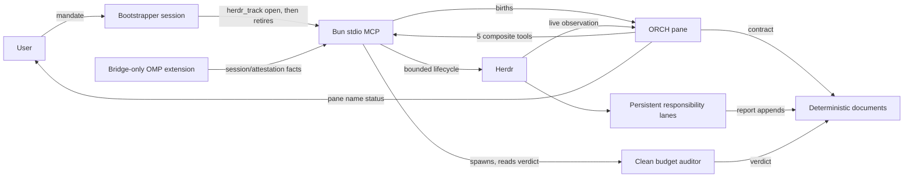
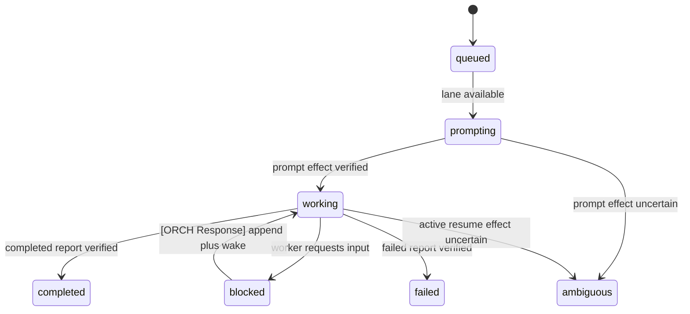

# Architecture

## Purpose

`herdr-delegator` is an OMP-only plugin for routing substantial independent work to persistent Herdr responsibility lanes. It separates durable contract, live control, and observation while preserving deterministic storage and verified OMP session identity.

The 1.0.0 package follows Agent Plugins 1.0.0: portable `plugin.json`, `skills/`, and `mcp.json` components plus one bridge-only OMP client extension under `io.github.edgar-min.herdr-delegator/`.

## Core model

- A **responsibility** is durable direction, ownership, and context.
- A **worker lane** is one persistent registry-owned Herdr tab and official OMP session serving a responsibility.
- An **assignment** is one immutable unit of work routed to a lane.
- An **ORCH** is born, never appointed: the session `herdr_track open` spawns into the track's own pane. Its birth record is the run's only command identity, and the session that opened the track is retired for it.
- A **mandate** fixes what a track must achieve and why; `plan.md` is the born ORCH's own document and the only place how belongs.
- A **budget** is a justification cadence: metered at every guarded op, parked explicitly when exceeded, extended only against a bounded justification a clean auditor judges.

Exact responsibility reuse is the default. Each lane has one active assignment and a FIFO queue. Assignment completion returns the lane to idle without closing its tab or OMP session.



## Product boundaries

Official support is OMP-only. The design does not predefine an adapter interface for another agent runtime.

The plugin does not:

- perform automatic decomposition or responsibility scoring;
- impose a fixed worker ceiling;
- create a lane merely because a matching lane is busy;
- expose raw Herdr socket, pane, tab, workspace, argv, or command control;
- verify host OMP task/subagent models;
- make overlapping shared-directory edits safe;
- close the retained Herdr workspace.

## Package and process boundaries

### Portable package core

`plugin.json` is the Agent Plugins 1.0.0 manifest. The fixed `skills/` directory and root `mcp.json` are the portable components. `package.json` remains npm metadata and preserves current OMP extension-module compatibility; it is not portable manifest authority.

### OMP extension

`io.github.edgar-min.herdr-delegator/extensions/herdr-delegator.ts` registers only the OMP bridge. It does not register public delegation tools.

`io.github.edgar-min.herdr-delegator/extensions/lib/bridge.ts`:

- refreshes on OMP session start, session switch, and before agent start;
- publishes a strict identity-only version-1 fact: session ID, optional corroborating session path, pane ID, issue time, and nonce;
- writes that fact atomically to an owner-only session-scoped file under the active OMP agent directory;
- reports exactly the matching session and attestation tokens to the verified Herdr caller pane.

The reverse-domain directory and matching `plugin.json#extensions` member contain client-specific OMP data. Current OMP loads the entry through `package.json#omp.extensions`. The bridge is not a model-visible tool and does not execute worker lifecycle.

### MCP server

The Agent Plugins root `mcp.json` starts bare `sh` with `${PLUGIN_ROOT}/bin/herdr-delegator-mcp` as its sole argument and `cwd` `${PLUGIN_ROOT}`, avoiding OMP 18.0.5's unresolved plugin-relative `posix_spawn` command. The POSIX launcher resolves Bun from `PATH`, `${BUN_INSTALL}/bin/bun`, or `${HOME}/.bun/bin/bun`, then quietly execs `${PLUGIN_ROOT}/mcp/server.ts`. `mcp/server.ts` registers exactly:

- `herdr_track`
- `herdr_assignment`
- `herdr_worker`
- `herdr_message`
- `herdr_friction`

It emits JSON-RPC on stdout and diagnostics on stderr.

### MCP modules

| Module | Responsibility |
|---|---|
| `mcp/server.ts` | stdio transport, five registrations, strict action parsing, structured results |
| `mcp/contracts.ts` | public schemas, bounded identifiers, seven assignment states, result/error shapes, bridge schema |
| `mcp/herdr-adapter.ts` | verified Herdr binary and schema, fixed bounded argv, prompt/wait/response/metadata primitives |
| `mcp/registry.ts` | immutable assignment parsing, responsibility routing, lane queueing, minimal delegation registry and lock |
| `mcp/tools.ts` | composite track/assignment/worker transactions, bridge verification, settlement, observation, close preparation |
| `io.github.edgar-min.herdr-delegator/extensions/lib/config.ts` | layered configuration, deterministic run coordinates, manifests, atomic file authority |
| `io.github.edgar-min.herdr-delegator/extensions/lib/runtime.ts` | retained lifecycle authority for workspace/session identity verification, resume, focus, anchor recreation, and guarded close |
| `io.github.edgar-min.herdr-delegator/extensions/lib/worker.ts` | internal worker ensure/inspect/close operations consumed by MCP |
| `io.github.edgar-min.herdr-delegator/extensions/lib/track.ts` | internal run initialization, target-ORCH lifecycle, and session retirement consumed by MCP |
| `io.github.edgar-min.herdr-delegator/extensions/lib/templates.ts` | shipped protocol-template digests, so a template change never strands an existing run |
| `mcp/budget.ts` | metering, clamp parsing and token-axis classification, the clamp write helper, covenant math, audit document rendering, verdict parsing |
| `mcp/revival.ts` | rebirth approval, documents-sufficiency, and ambiguity gates, and the force-close approval reader |

Public calls terminate at the five MCP composite tools. Internal lifecycle functions are implementation detail, not an alternate public surface.

## Three-channel authority

| Channel | Carries | Does not carry |
|---|---|---|
| Documents | goal, ownership, dependencies, user boundaries, decisions, durable results, completion, verification, handoff | live terminal control |
| MCP prompt/control | canonical IDs and hashes, waits, lifecycle gates, budget justification, revival | ad hoc duplicated contracts or raw Herdr commands |
| Herdr metadata/UI | responsibility, assignment, assignment state, live status, pane status markers, bootstrap observation | contract, settlement, judgment, or session authority by itself |
| Doorbells | one bounded pointer, sent after a document append, naming a report, channel, or run | authority of any kind — the named file alone carries facts |

Communication is uniform across every relationship: the document append carries authority and the doorbell carries a pointer.

| Relationship | Conversations | Document (authority) | Doorbell |
|---|---|---|---|
| user → ORCH | delegate, intervene, stop | mandate, `budget-clamp.json`, `rebirth-approval.json`, `close-approval.json` | direct pane chat |
| ORCH → user | report, decision request | `budget-ledger.md`, `plan.md`, reports | pane-name status marker |
| ORCH → worker | direct, respond, nudge | assignment, `[ORCH Response]` in the lane report | dispatch delivery, `wake_worker` |
| worker → ORCH | completion, blocked, decision request | report append | `wake_orch` |
| worker ↔ worker | adjacent coordination (plan-authorized) | `a2a/w<N>-to-w<M>.md` | `wake_peer` |
| ORCH ↔ ORCH | negotiate, notify, handoff | `a2a/orch-to-<to_track_id>_<to_run_id>.md` | `notify_run` |
| server ↔ auditor | budget audit | `budget-audit-<n>.md`, ledger verdict | internal |
| forbidden | cross-organization worker messaging (escalate instead), ORCH↔auditor contact, shadow channels | — | — |

A doorbell to a currently focused target is deferred in the server process: wait 60 seconds, re-probe once, then send immediately if focus moved or the probe failed, otherwise wait a final 90 seconds and send exactly once. The call returns `delivery: "deferred"` without waiting. `a2a/messages.jsonl` records the scheduled row immediately and a final delivered/failed row after the background send. Server shutdown may lose that soft send because the named document already carries the authoritative content; the absent final row makes the loss observable.

Terminal output is a bounded observation, not a durable result.

## Deterministic storage

Run identity is `(track_id, run_id)` and resolves to:

```text
<storage.root>/<track_id>/<run_id>
```

The model never supplies this path directly.

```text
<run>/
  run.json
  protocol.md
  protocol-orch.md
  protocol-worker.md
  guidance.md
  plan.md
  evidence.md
  a2a/
    assignments/
      A-NNN.md
    delegation.json
    .delegation.lock
    herdr-workers.json
    .herdr-workers.lock
    w<N>-report.md
```

`plan.md`, `evidence.md`, assignment files, and reports exist only when authored. Initialization does not create placeholders. `guidance.md` is rendered by `open` and by both `revive` modes, never by `init`, and every layout and reconcile check tolerates its absence so runs created before it still load.

`delegation.json` is the minimal responsibility/assignment routing authority. `herdr-workers.json` remains the lifecycle identity/session/workspace authority. Both and their locks are tool-owned, mode-0600 control-plane files.

## Immutable assignment contract

The only assignment artifact is `<run>/a2a/assignments/A-NNN.md`.

It has strict frontmatter:

1. `assignment_id`
2. `responsibility_key`
3. `profile`

and strict sections:

1. Goal
2. Completion conditions
3. Write ownership
4. Dependencies
5. User boundaries

The artifact becomes immutable when its SHA-256 is submitted as `instructions_sha256`. No contract JSON or receipt JSON exists.

Settlement requires an exact `[Assignment Completion: A-NNN]` block with one `status: completed|failed` line in the bound worker report. MCP stores the full report hash and completion timestamp in `delegation.json`.

## Responsibility routing

For `herdr_assignment.add`:

1. verify the assignment file, grammar, coordinates, and hash;
2. find the exact responsibility's primary or matching separated lane;
3. queue FIFO when that lane is active;
4. create a lane only when none exists or a valid separation requires one;
5. reserve worker ordinals already present in delegation state, lifecycle state, or canonical worker artifacts;
6. ensure and verify the selected lane before prompt;
7. send only a pointer to the immutable artifact and report coordinate.

Additional same-responsibility lanes require:

```text
kind: direction | ownership | dependency
reason: bounded non-empty text
conflicts_with_worker_id: existing lane
```

There is no fixed number of lanes and no complex scoring policy.

## Public actions

### `herdr_track`

- `open {cwd, mandate}` — the single atomic birth; retires the calling session for that track
- `init {cwd, reset_of?}` — legacy layout for reset siblings and handoff targets
- `inspect` — registry, ORCH, totals, and budget
- `start_orchestrator` — legacy spawn; refused on an `open`-managed run
- `budget_extend {justification, requested_tokens?, wait?}`
- `revive {mode?}` — `resume` (default) or `rebirth`
- `close {expected_registry_revision}`

### `herdr_assignment`

- `preflight {assignment_id, responsibility_key}` — grammar validation and server-computed hash before immutability; no mutation
- `add {assignment_id, responsibility_key, instructions_sha256, separation?, wait?}`
- `wait {assignment_id, wait?}`

There is no response action: a worker is answered by an `[ORCH Response]` append to its report plus `herdr_message wake_worker`.

### `herdr_worker`

- `list {responsibility_key?}`
- `inspect {worker_id, output_lines?}`
- `resume {worker_id, expected_session_id}`
- `close {worker_id, expected_session_id, expected_state_change_seq}`

Every action also includes `track_id` and `run_id`. Strict discriminated schemas reject extra or action-inappropriate fields.

### Advisory skill routes

Configuration may declare `skill_routing` in two cooperating parts. `skills` is a per-skill authored metadata map (`intent`, `trigger`); no installed-presence detection of any kind exists (no lockfile lookup, no SKILL.md disk walk) — a missing skill is a reader-side no-op and skill bodies resolve natively via `skill://`. `rules` accepts two shapes: legacy `boundary` × `surface` rules (optional rule-level `trigger` and `profiles`) parse unchanged, and the newer `{ agent, moment, skills }` shape lowers at parse time into the same internal vocabulary — orch moments `plan|authoring|settlement|reset` are existing boundary names, and a profile agent's `intake`/`report` lower to worker `dispatch`/`completion` scoped to that profile — so resolvers and every delivery site see one shape. The MCP layer surfaces matching rules as `skill_routes` in `init`, `preflight`, and terminal assignment results, and appends worker-surface routes to the dispatch prompt pointer, filtered by the lane's assignment profile. Route lookup never blocks control flow and routes carry no authority.

Two run documents render from resolved configuration as pure projections — the renderer authors no sentences; every content block maps to a config coordinate, plus a closed set of fixed structural strings. `guidance.md` carries the ORCH's worker-profile selection table (each profile's `intent`; the legacy `guidance` field serves as `intent` fallback) and the orch-moment routes with each skill's `intent` and `trigger`; it renders at `open` and both revival modes. `guidance-<profile>.md` carries that profile's `directive` and its intake/report routes; it is materialized at dispatch and named in the dispatch pointer as advisory. The asymmetry is deliberate: `intent` renders only to the selector, `directive` only to the selected. Absence is a no-op everywhere: a profile with neither directive nor routes renders no document and the pointer names none; a render failure degrades to a named-failure document (ORCH) or a pointer-omitting warning (lane) and never blocks a birth or dispatch.

## State and transitions

Assignment state is exactly:

```text
queued | prompting | working | blocked | completed | failed | ambiguous
```



A wait timeout does not mutate state and surfaces as a successful `timed_out` observation with the fresh lane state, never an error. Potentially effected prompt or active-assignment resume ambiguity converges on `ambiguous`. Internal operation details do not become additional public assignment states.

At terminal settlement the lane becomes idle, records the last assignment, and promotes the FIFO head. Lane close is a separate lifecycle transition.

## Settlement observability

At prompt, MCP persists the tool-owned `prompted_at` boundary. At terminal settlement it may persist nonnegative safe-integer `elapsed_ms`, a cumulative `token_usage` snapshot read from the verified official session's canonical OMP JSONL, and `advisory_unowned_changes`. JSONL is the token authority; tool timestamps are the elapsed/activity-time authority. These are cumulative session and wall-time observations, not per-assignment token attribution or budget enforcement.

The unowned-change observation compares bounded Git porcelain paths with the union of active or settling assignment ownership. It is explicitly advisory, does not attribute changes to a worker, and fails open: non-git workspaces, timeout, oversized or malformed output, unsafe paths, and any command or ownership error omit the observation without affecting settlement.

Worker inspection returns `staleness` from persisted pane-revision activity timing plus the exact queued-assignment `queue_depth`, excluding the active assignment. Track inspection returns lane count, exact counts across the unchanged seven assignment states, counts and cumulative elapsed/token observations, and a `saturated` flag. Cumulative values clamp to `Number.MAX_SAFE_INTEGER` only when addition would overflow; that clamping sets `saturated`.

ORCH uses settlement actuals, staleness, queue depth, track totals, and unowned-change paths as bounded signals for possible over- or under-spend and scope drift. They never authorize mutation, prove attribution or correctness, impose a threshold, or replace ORCH judgment.

## Budget and revival

Settlement observability is advisory; the budget machine is not. Every guarded op meters the run — each ORCH generation and every lane session, from the official OMP JSONL on a generative basis, plus wall clock — and judges it against a cap seeded by the mandate. Crossing the cap parks the run: a named reason in the registry, an entry in the append-only `budget-ledger.md`, and a marker on the ORCH pane name. Only a landing allowlist runs while parked, and the run resumes by itself once judged back under the ceiling.

An extension costs a bounded justification, obeys a per-extension step cap and a minimum interval, and grants nothing until a clean auditor — spawned by the server, never by the ORCH, and not a responsibility lane — appends a verdict the server records. A deny ends the ladder at the user. Fresh open scaffolds `budget-clamp.json`; every park path scaffolds it lazily for older runs. Creation is owner-only and never overwrites an existing file. Park/deny recovery and ledger entries name its exact editable schema `{version:1, max_tokens?, max_minutes?, note?}`. Money units and precise cost accounting remain out of scope.

The clamp file stays human-owned, and a present bound is the effective ceiling — which is why an approved grant has to reach it. Under the default `notify` policy a grant of more than zero tokens writes the new granted figure into `max_tokens`, so the approval is visible where the human looks, and the registry records the value the server intended to write and then the value it confirmed as written. Those two values are the whole basis of the judgment: the server rewrites `max_tokens` only where the value on disk is absent or equal to one of them, and a present value equal to neither reads as the human's own ceiling, `0` included. That reading is "not provably server-authored" and never a claim about who typed the file (NG-014). Under such a pin the effective token cap cannot rise, an over-cap token axis parks `approval-required` naming the pinned file and the human decision, `budget_extend` is refused unless the run is over on wall clock with no `max_minutes` set, and the auditor's own input document says the token ceiling cannot move. Raising `max_tokens` above the judged spend resumes the run directly; an edit at or below it pins; deleting `max_tokens` hands the ceiling back and the next approved grant resumes automatic raises. Identity is by value, never by a fingerprint of the file, so editing `max_minutes` or `note` says nothing about the token ceiling — and a value equal to a ceiling the machine recorded reads as machine-written, which both clamp notes disclose.

Revival reads the same birth chain: `resume` reconnects the recorded birth session with no new generation, and `rebirth` starts generation+1 only behind the user's written approval, sufficient run documents, an ambiguity-free run, and a dead predecessor. When the recorded ORCH agent is gone but its canonical session path and identity-sound workspace survive, revival may recreate only the dead anchor tab/pane, atomically update the recorded coordinates, and resume that session; a live agent or dead/mismatched workspace keeps the strict prior behavior. A reborn generation inherits the metered spend it did not spend. A run whose recorded ORCH is provably gone is closed by an attested session against a human-owned close-approval.json, never by agent consensus.

## Model and session verification

The built-in orchestrator role is `@default`; a planning-grade role such as `@plan` with elevated thinking is recommended. The orchestrator is the highest-judgment seat: it holds minimal context and owns decisions, direction, delegation, and settlement — never bulk execution. The built-in worker profiles are exactly `default`, `task`, and `slow`, all selecting `@default` so they resolve without user configuration. Configured installations may map `task` to `@task`, `slow` to `@slow`, or select another bounded OMP role alias.

ORCH selects the assignment profile on two axes — specification maturity and cost of error:

- `default` — meticulous and linguistically strong; the general-purpose choice for dialogue-faithful execution, precise language/document work, and work where verification budget is thin. Its meticulousness can invert into over-engineering, so wide-discretion design work goes elsewhere or arrives with a narrowed specification.
- `task` — the highest output ceiling on concrete implementation, but less meticulous than `default`: assign only work with a mature specification, and verify its completions more deeply than other lanes. An immature specification here produces a high-quality-looking wrong answer.
- `slow` — the deepest reasoning; it is delegated thinking, not execution. By default, after drafting `plan.md` with the user and before freezing it, ORCH assigns a slow-profile lane to rebut the draft; trivially fixed plans may record why they skip that review, and user-authority items retain their normal route. The adversarial charge is repository-owned, while the review's reasoning depth follows the installation's role mapping for `slow`. Use it otherwise for verification, design-fork research, and audits right before judgments whose failure is expensive; never assign artifact implementation. It is also the profile the server spawns budget auditors on.

Cost-efficient small mechanical work routes to host OMP task/subagents under RTE-002, so no persistent lane profile exists for it.

1. The bridge publishes a strict identity-only fact `{version, session_id, reported_session_path?, pane_id, issued_at, nonce}` and exactly two pane tokens: session and attestation.
2. MCP derives the fact coordinate from the verified caller pane and active OMP agent directory.
3. MCP verifies owner, non-symlink type, modes, strict schema, official session/path/pane correspondence, nonce, timestamp, and exact equality with the session/attestation pane tokens.
4. Child launch passes the configured ROLE — an unresolved alias, or nothing at all for `default` — never a model the caller resolved. The child expands it against its own persisted settings, so a caller's process-local model override cannot decide a child's model (MOD-007).
5. Before prompt, the child bootstrap verifier independently checks the same session/attestation identity. After prompt, canonical JSONL verifies official session identity and reads provider/model, fallback, and thinking; the caller holds no expected model to compare against, so those are observations, not judgments. A session whose thinking selector is `auto` writes no `thinking_level_change` record until its first turn classifies, so a missing thinking observation is reported as absence instead of blocking verification.

Fresh `open` alone may cross `omp_fact_bridge_mismatch`. Its creator record is either attested `{session_id, pane_id, mandate_sha256, opened_at, verified?: true}` or degraded `{pane_id, mandate_sha256, opened_at, verified: false}` with no session ID. A later attested retry on the same pane upgrades degraded to verified; an outage never downgrades a verified record. Every operation on an existing run remains fail-closed behind the identity verifier.

Resume uses only this verified official session. Missing, stale, unsafe, mismatched, or credibly duplicated sessions fail closed.

## Focus, ambiguity, and close

Focus restoration only reverses displacement onto registry-owned coordinates. Unrelated current user focus is preserved.

Mutating timeout handling is observe-before-retry:

1. inspect assignment, lane, and lifecycle identity;
2. verify state sequence, prompt/response fingerprint, report, session, and topology;
3. continue from a proved effect or retry only after proved absence;
4. preserve coordinates when ambiguity remains.

Worker close requires a fresh expected session ID and state sequence. Safe topology permits only the registry root pane and structurally verified Herdr Sidebar panes. Track close first verifies a fresh registry revision and all candidates; any active or unsafe lane rejects the whole close.

Assignment completion never implies worker or track closure.

## Reset and reload boundaries

A sibling reset uses a different run coordinate, copies the source plan, and fixes policies to `close-settled-preserve-active` and `revalidate-before-import`. It does not import evidence as truth or mutate source workers.

The target ORCH launches under the configuration-selected OMP role. `/reload-plugins` refreshes the skill and MCP server; extension cutover verification requires a new OMP session.
