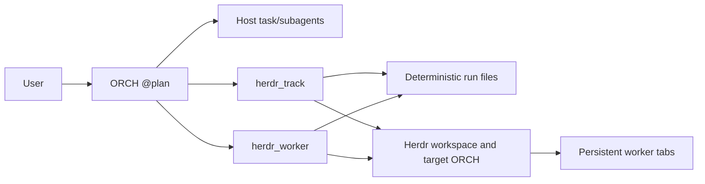
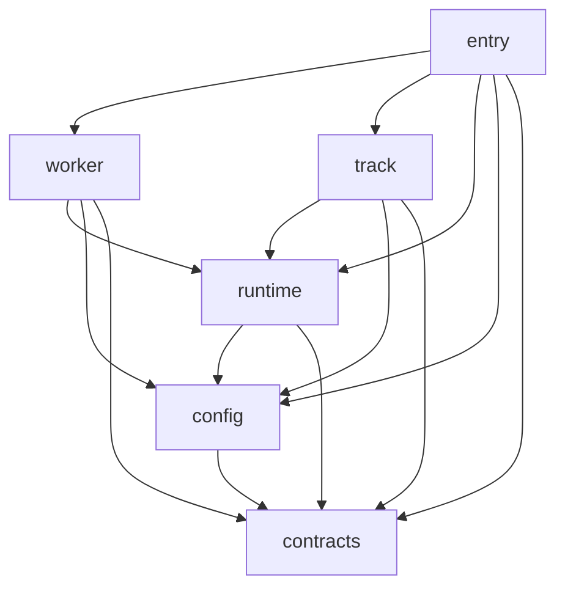
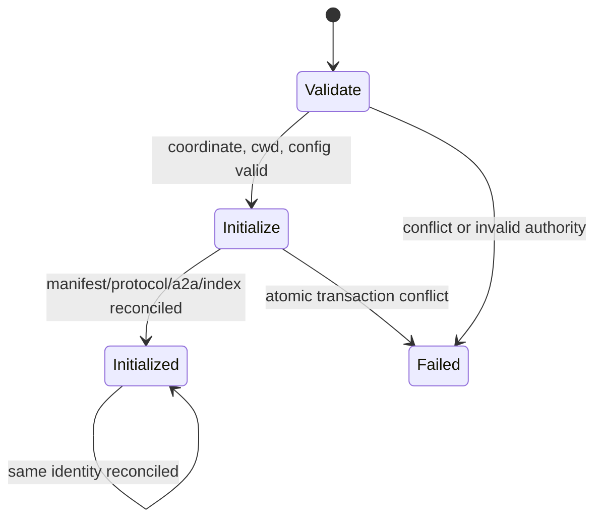

# Architecture

## Purpose

`herdr-delegator` connects an OMP planning session to persistent Herdr worker tabs while keeping deterministic files as the audit source of truth. The design separates judgment, bounded host delegation, durable execution, and reset handoff.

## Actors

- **ORCH**: the current OMP session under fixed role `@plan`. It decomposes work, owns judgment, writes plans and instructions, resolves decisions, verifies results independently, and performs recovery and closure.
- **Host task/subagents**: short-lived OMP delegation for bounded mechanical or light work. They are outside the Herdr registry and this plugin does not select or verify their models.
- **Herdr workers**: persistent OMP sessions, one registry-owned tab per worker, for substantial independent slices. They operate in the run's canonical project `cwd`.
- **Target reset ORCH**: a fresh or reconciled `@plan` session launched for a sibling run. It uses the target run's own identity and official session; it never resumes the source ORCH context as the target.



Herdr transports prompts and observations. The registry binds those live objects to deterministic run identity; neither labels nor terminal output alone establish ownership.

## Deterministic storage and authority

Configuration resolves `storage.root` from strict user and project layers. A run-local layer may change model-profile leaves but may not move its own storage root. The canonical run path is derived, never supplied directly by a model:

```text
<storage.root>/<track_id>/<run_id>
```

The identity is `(track_id, run_id)`, with canonical lowercase coordinates. `run.json` binds those coordinates to the canonical project `cwd` and resolved run path.

Authority is divided deliberately:

| Authority | Files or state |
| --- | --- |
| Storage tool | `<storage.root>/index.json`, run initialization transaction, run manifest, bundled protocol copy, reset lineage |
| Worker tool | `a2a/herdr-workers.json`, registry lock, workspace/tab/pane/session bindings, prompt fingerprints, state sequences |
| ORCH | `plan.md`, `evidence.md`, orchestrator instructions, worker instructions, responses, closure judgments |
| Worker or target ORCH | Its own report; declared directional peer file only when authorized |
| Herdr | Workspace, tab, pane, relay, focus, and live-agent observations |
| OMP | Role/model resolution, official session JSONL, host task/subagent execution |

Tool-owned indexes, registries, and locks are never manually edited, moved, copied, or unlocked. Runtime output is an observation, not a substitute for an authored report or independent verification.

## Module responsibilities

| Module | Responsibility |
| --- | --- |
| `extensions/herdr-delegator.ts` | Registration-focused entry: registers strict `herdr_worker` and `herdr_track` public tools, validates operation-specific inputs, dispatches to lifecycle modules, emits bounded summaries/details, and wires session-start/session-switch bootstrap-attestation reporting. |
| `extensions/lib/contracts.ts` | Dependency-free shared constants, public/internal states, TypeScript contracts, identifiers, limits, hashing, and contract errors. |
| `extensions/lib/config.ts` | Strict layered configuration and role-profile resolution; canonical coordinate/path validation; manifest/reset/registry validation; instruction constraints; atomic files; storage index parsing. Configuration represents roles and thinking, never concrete model IDs. |
| `extensions/lib/runtime.ts` | Herdr process boundary, registry locks, workspace/pane/session reconciliation, child launch with caller-resolved concrete model/thinking, in-process bootstrap attestation, official JSONL verification, duplicate protection, focus restoration, and agent start/resume mechanics. |
| `extensions/lib/worker.ts` | Worker lifecycle: ensure, prompt/wait, inspect, block response, guarded Sidebar-aware close, deduplication, and worker recovery. |
| `extensions/lib/track.ts` | Run initialization, sibling reset artifacts, target ORCH start/reconciliation, target inspection, prompt deduplication, persisted recovery verification, and track-level results. |

### Dependency direction



Dependencies flow from the registration entry through lifecycle orchestration toward shared mechanisms and contracts. `contracts` has no dependency on the other extension modules. The graph is acyclic; lifecycle ownership remains in `worker` and `track` rather than accumulating in the entry.

## State machines

### Run initialization



`init_run` creates the run and `a2a` directories, strict `run.json`, a byte-for-byte bundled `protocol.md`, and the storage index row. Existing content must reconcile exactly. An uninitialized directory containing unowned files fails instead of being adopted.

For a sibling reset, the target coordinate must differ from the source. The source manifest and canonical `plan.md` are validated; the plan is copied byte-for-byte, its SHA-256 is recorded, and fixed worker/evidence policies are written to `reset.json`.

### Worker

```mermaid
stateDiagram-v2
  [*] --> planned
  planned --> pane-created
  pane-created --> agent-ready
  agent-ready --> prompted
  prompted --> working
  working --> idle
  working --> done
  working --> blocked
  blocked --> working: resolve_block at exact sequence
  idle --> closed: guarded close
  done --> closed: guarded close
  failed --> closed: only if fresh proof permits
  planned --> failed
  pane-created --> failed
  agent-ready --> failed
  prompted --> failed
  working --> failed
```

The registry also uses transient `prompting` and `closing` states. Public observations normalize internal state where appropriate. Every transition is bound to the same run, worker key, workspace, tab, root pane, configured profile, and official session evidence.

### Target ORCH

A target starts only after canonical `plan.md` and `orchestrator-instructions.md` exist. `start_orch` resolves the instruction itself, verifies the caller and target against configured `@plan` identity, creates or reconciles the run workspace, fingerprints delivery, and records target identity. `inspect_orch` is required before judgment or recovery. A dead ORCH cannot start itself; a live predecessor or native control surface is required.
Target recovery is fingerprint-first. If an ambiguous first return persisted `prompt_state: prompting`, that value may remain permanently as a never-replay guard. Recovery does not need to rewrite it to `prompted`: `verified_at` plus persisted fallback/model facts establishes persisted verification and settled state after exact JSONL reconciliation.

### Close, resume, and reset

- **Resume**: only the exact registry-recorded official OMP session path whose JSONL exists and whose persisted identity has been verified is eligible. A path reported during bootstrap may precede file creation and is not yet resume authority. Native Herdr restoration is preferred. A manual resume requires a proved owned interactive shell or one owned replacement tab plus duplicate checks.
- **Close**: only after fresh inspection proves a settled state and exact registry ownership. The worker tab may contain only its root pane and strictly verified Herdr Sidebar auxiliaries. After close, `inspect_worker` may return `agent_not_found`; the registry `closed` record is authoritative and the retained run anchor remains. The retained workspace is never closed by a public operation.
- **Reset**: a sibling run receives copied planning context but not trusted old evidence. Settled source workers may close through the normal guarded path; active, blocked, unknown, conflicted, ambiguous, or unsafe workers remain preserved at the source coordinate.

## Model-role resolution and session verification

Built-in routing fixes ORCH at `@plan` with inherited thinking and provides `default` (`@default`) and `slow` (`@slow`) worker profiles. Configuration can override worker role/thinking leaves or add bounded profiles. It accepts role aliases, never concrete model IDs, and `ensure_worker` always receives an explicit profile.

Launch pinning precedes a two-stage session gate:

The calling OMP process first resolves the configured role to the exact concrete provider/model and effective thinking. The child OMP process launches with those captured concrete values, eliminating cross-process role-alias drift.

1. **Pre-prompt gate:** before any work prompt, the child extension reports session-bound in-process bootstrap attestation through Herdr pane metadata: official session ID and reported path, concrete provider/model, thinking, nonce, and timestamp. The controller proves the intended pane/session and compares every expected fact exactly.
2. **Persisted gate:** the reported session path may precede JSONL creation and is not resume-eligible at that point. After the first prompt boundary, persisted JSONL must exist and match bootstrap/session/model/thinking/fallback before the operation succeeds or the session becomes resume-eligible.

Attestation/report failure is fail-closed. The controller never sends a synthetic prompt merely to create JSONL. Reconciliation also rejects missing, corrupt, oversized, mismatched, concurrently resumed, or credibly duplicated sessions. Host task/subagents remain outside this model-verification contract.

## Focus and Sidebar concurrency

Focus handling is ownership-aware:

1. Capture the current Herdr focus before mutation.
2. Record only registry-owned tabs/panes created or selected by the operation.
3. Restore focus only if the operation displaced it onto those owned coordinates.
4. Skip restoration if focus moved elsewhere, treating that as possible concurrent user action.

`focus_restoration: partial` is surfaced as a warning and does not erase the operation's proven effect.

Safe close treats auxiliary panes as a proof problem. A Sidebar is accepted only when it shares the worker's workspace/tab and canonical run `cwd`, has exact label `Sidebar`, has no non-null `agent` or `agent_session`, and exposes a non-empty token object whose every key starts with `herdr-sidebar-`. Any additional or ambiguous pane prevents closure.

## Prompt, block, and deduplication

`prompt_wait` accepts only the canonical `<run>/a2a/<worker_id>-instructions.md`. The tool fingerprints the instruction and records intent before delivery. Matching fingerprints in prompting, prompted, working, idle, done, or blocked states are deduplication evidence; the ORCH inspects rather than resends.

After delivery, new information is appended as an `[ORCH Addendum]` for consumption at a natural boundary rather than rewriting submitted instructions.

A block response requires a fresh `blocked` observation and the exact `expected_state_change_seq`. Bounded text is for free-form text input. An interactive option dialog requires inspection and bounded allowlisted keys, such as `enter` for a preauthorized recommended selection. A response that leaves state and sequence unchanged is a no-effect observation, not permission to replay blindly. Only a grounded non-user decision may be supplied automatically.

## Failure and ambiguous-effect recovery

Every result carries `ok`, operation, state, retryability, deterministic key/registry coordinate, and either bounded observations or a structured error with phase, ambiguity, and recovery guidance.

Timeouts during prompt delivery, block response, or close may have changed external state. Recovery is therefore observe-before-retry:

1. Inspect deterministic run and registry identity.
2. Verify workspace/tab/pane ownership and live state/sequence.
3. Verify prompt fingerprint/state, report presence, official session, and bounded output.
4. For closure, verify topology and whether the owned tab still exists.
5. Continue from a proved effect, or retry only after proving absence.
6. If effect or ownership remains ambiguous, preserve all coordinates and stop mutation.

Creating a new worker number is not an identity-conflict recovery mechanism.

## Trust boundaries

Trusted only after validation:

- strict configuration layers and hashes;
- canonical storage, run, project, instruction, registry, and session paths;
- run/reset manifests and deterministic identities;
- registry-owned workspace/tab/pane bindings;
- OMP-resolved role/model/thinking identity and official JSONL evidence;
- Herdr Sidebar structural proof.

Untrusted by default:

- model-supplied paths or resume arguments;
- labels, terminal text, and report claims without structural or independent evidence;
- stale state sequences and prior-run evidence;
- unowned panes, workspaces, sessions, and manual registry changes;
- secrets or personal data placed in audit artifacts.

## Non-goals

- General-purpose terminal, process, workspace, or secret management.
- Automatic decomposition, approval, prioritization, or user-judgment replacement.
- Model selection or verification for host task/subagents.
- Safe concurrent editing of overlapping files in a shared project directory.
- Automatic closure of the retained Herdr workspace.
- Treating old reset evidence as current truth.
- Repairing malformed configuration, registries, sessions, or ambiguous ownership by guessing.
