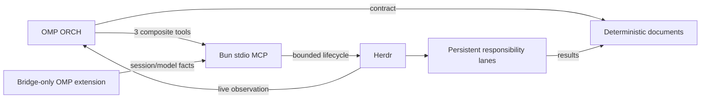
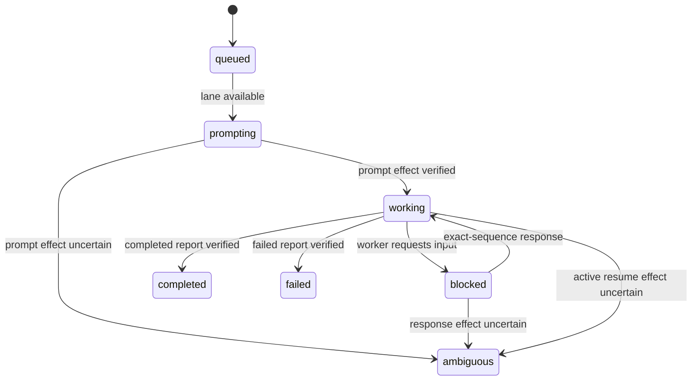

# Architecture

## Purpose

`herdr-delegator` is an OMP-only plugin for routing substantial independent work to persistent Herdr responsibility lanes. It separates durable contract, live control, and observation while preserving deterministic storage and verified OMP session identity.

The 1.0.0 package follows Agent Plugins 1.0.0: portable `plugin.json`, `skills/`, and `mcp.json` components plus one bridge-only OMP client extension under `io.github.edgar-min.herdr-delegator/`.

## Core model

- A **responsibility** is durable direction, ownership, and context.
- A **worker lane** is one persistent registry-owned Herdr tab and official OMP session serving a responsibility.
- An **assignment** is one immutable unit of work routed to a lane.
- An **ORCH** is the OMP session that decomposes, routes, decides, verifies, and recovers.

Exact responsibility reuse is the default. Each lane has one active assignment and a FIFO queue. Assignment completion returns the lane to idle without closing its tab or OMP session.



## Product boundaries

Official support is OMP-only. The design does not predefine an adapter interface for another agent runtime.

The plugin does not:

- perform automatic decomposition or responsibility scoring;
- impose a fixed worker ceiling;
- create a lane merely because a matching lane is busy;
- expose raw Herdr socket, pane, tab, workspace, argv, or command control;
- verify host OMP task/subagent models;
- make overlapping shared-directory edits safe;
- close the retained Herdr workspace.

## Package and process boundaries

### Portable package core

`plugin.json` is the Agent Plugins 1.0.0 manifest. The fixed `skills/` directory and root `mcp.json` are the portable components. `package.json` remains npm metadata and preserves current OMP extension-module compatibility; it is not portable manifest authority.

### OMP extension

`io.github.edgar-min.herdr-delegator/extensions/herdr-delegator.ts` registers only the OMP bridge. It does not register public delegation tools.

`io.github.edgar-min.herdr-delegator/extensions/lib/bridge.ts`:

- refreshes on OMP session start, session switch, and before agent start;
- resolves configured OMP role aliases to concrete provider/model facts;
- records current provider/model/thinking separately from configured roles;
- writes an owner-only session-scoped fact under the active OMP agent directory;
- reports matching bootstrap metadata to the verified Herdr caller pane.

The reverse-domain directory and matching `plugin.json#extensions` member contain client-specific OMP data. Current OMP loads the entry through `package.json#omp.extensions`. The bridge is not a model-visible tool and does not execute worker lifecycle.

### MCP server

The Agent Plugins root `mcp.json` starts bare `sh` with `${PLUGIN_ROOT}/bin/herdr-delegator-mcp` as its sole argument and `cwd` `${PLUGIN_ROOT}`, avoiding OMP 18.0.5's unresolved plugin-relative `posix_spawn` command. The POSIX launcher resolves Bun from `PATH`, `${BUN_INSTALL}/bin/bun`, or `${HOME}/.bun/bin/bun`, then quietly execs `${PLUGIN_ROOT}/mcp/server.ts`. `mcp/server.ts` registers exactly:

- `herdr_track`
- `herdr_assignment`
- `herdr_worker`

It emits JSON-RPC on stdout and diagnostics on stderr.

### MCP modules

| Module | Responsibility |
|---|---|
| `mcp/server.ts` | stdio transport, three registrations, strict action parsing, structured results |
| `mcp/contracts.ts` | public schemas, bounded identifiers, seven assignment states, result/error shapes, bridge schema |
| `mcp/herdr-adapter.ts` | verified Herdr binary and schema, fixed bounded argv, prompt/wait/response/metadata primitives |
| `mcp/registry.ts` | immutable assignment parsing, responsibility routing, lane queueing, minimal delegation registry and lock |
| `mcp/tools.ts` | composite track/assignment/worker transactions, bridge verification, settlement, observation, close preparation |
| `io.github.edgar-min.herdr-delegator/extensions/lib/config.ts` | layered configuration, deterministic run coordinates, manifests, atomic file authority |
| `io.github.edgar-min.herdr-delegator/extensions/lib/runtime.ts` | retained lifecycle authority for workspace/session/model verification, resume, focus, and guarded close |
| `io.github.edgar-min.herdr-delegator/extensions/lib/worker.ts` | internal worker ensure/inspect/respond/close operations consumed by MCP |
| `io.github.edgar-min.herdr-delegator/extensions/lib/track.ts` | internal run initialization and target-ORCH lifecycle consumed by MCP |

Public calls terminate at the three MCP composite tools. Internal lifecycle functions are implementation detail, not an alternate public surface.

## Three-channel authority

| Channel | Carries | Does not carry |
|---|---|---|
| Documents | goal, ownership, dependencies, user boundaries, decisions, durable results, completion, verification, handoff | live terminal control |
| MCP prompt/control | canonical IDs and hashes, waits, fresh blocked responses, resume/close gates | ad hoc duplicated contracts or raw Herdr commands |
| Herdr metadata/UI | responsibility, assignment, assignment state, live status, bootstrap observation | contract, settlement, judgment, or session authority by itself |

Terminal output is a bounded observation, not a durable result.

## Deterministic storage

Run identity is `(track_id, run_id)` and resolves to:

```text
<storage.root>/<track_id>/<run_id>
```

The model never supplies this path directly.

```text
<run>/
  run.json
  protocol.md
  plan.md
  evidence.md
  a2a/
    assignments/
      A-NNN.md
    delegation.json
    .delegation.lock
    herdr-workers.json
    .herdr-workers.lock
    w<N>-report.md
```

`plan.md`, `evidence.md`, assignment files, and reports exist only when authored. Initialization does not create placeholders.

`delegation.json` is the minimal responsibility/assignment routing authority. `herdr-workers.json` remains the lifecycle identity/session/workspace authority. Both and their locks are tool-owned, mode-0600 control-plane files.

## Immutable assignment contract

The only assignment artifact is `<run>/a2a/assignments/A-NNN.md`.

It has strict frontmatter:

1. `assignment_id`
2. `responsibility_key`
3. `profile`

and strict sections:

1. Goal
2. Completion conditions
3. Write ownership
4. Dependencies
5. User boundaries

The artifact becomes immutable when its SHA-256 is submitted as `instructions_sha256`. No contract JSON or receipt JSON exists.

Settlement requires an exact `[Assignment Completion: A-NNN]` block with one `status: completed|failed` line in the bound worker report. MCP stores the full report hash and completion timestamp in `delegation.json`.

## Responsibility routing

For `herdr_assignment.add`:

1. verify the assignment file, grammar, coordinates, and hash;
2. find the exact responsibility's primary or matching separated lane;
3. queue FIFO when that lane is active;
4. create a lane only when none exists or a valid separation requires one;
5. reserve worker ordinals already present in delegation state, lifecycle state, or canonical worker artifacts;
6. ensure and verify the selected lane before prompt;
7. send only a pointer to the immutable artifact and report coordinate.

Additional same-responsibility lanes require:

```text
kind: direction | ownership | dependency
reason: bounded non-empty text
conflicts_with_worker_id: existing lane
```

There is no fixed number of lanes and no complex scoring policy.

## Public actions

### `herdr_track`

- `init {cwd, reset_of?}`
- `inspect`
- `start_orchestrator`
- `close {expected_registry_revision}`

### `herdr_assignment`

- `add {assignment_id, responsibility_key, instructions_sha256, separation?, wait?}`
- `wait {assignment_id, wait?}`
- `respond {assignment_id, expected_state_change_seq, response}`

### `herdr_worker`

- `list {responsibility_key?}`
- `inspect {worker_id, output_lines?}`
- `resume {worker_id, expected_session_id}`
- `close {worker_id, expected_session_id, expected_state_change_seq}`

Every action also includes `track_id` and `run_id`. Strict discriminated schemas reject extra or action-inappropriate fields.

## State and transitions

Assignment state is exactly:

```text
queued | prompting | working | blocked | completed | failed | ambiguous
```



A wait timeout does not mutate state. Potentially effected prompt, response, or active-assignment resume ambiguity converges on `ambiguous`. Internal operation details do not become additional public assignment states.

At terminal settlement the lane becomes idle, records the last assignment, and promotes the FIFO head. Lane close is a separate lifecycle transition.

## Model and session verification

The built-in orchestrator role is `@default`; configuration may select any bounded OMP role alias. Worker profiles are similarly configuration-selected.

1. The bridge resolves configured roles inside OMP and publishes current session/model/thinking facts.
2. MCP derives the fact coordinate from the verified caller pane and active OMP agent directory.
3. MCP verifies owner, non-symlink type, modes, strict schema, session/pane correspondence, nonce, timestamp, and metadata exact match.
4. Child launch uses the resolved concrete provider/model and effective thinking.
5. After prompt, canonical JSONL verifies official session, model, thinking, and fallback.

Resume uses only this verified official session. Missing, stale, unsafe, mismatched, or credibly duplicated sessions fail closed.

## Focus, ambiguity, and close

Focus restoration only reverses displacement onto registry-owned coordinates. Unrelated current user focus is preserved.

Mutating timeout handling is observe-before-retry:

1. inspect assignment, lane, and lifecycle identity;
2. verify state sequence, prompt/response fingerprint, report, session, and topology;
3. continue from a proved effect or retry only after proved absence;
4. preserve coordinates when ambiguity remains.

Worker close requires a fresh expected session ID and state sequence. Safe topology permits only the registry root pane and structurally verified Herdr Sidebar panes. Track close first verifies a fresh registry revision and all candidates; any active or unsafe lane rejects the whole close.

Assignment completion never implies worker or track closure.

## Reset and reload boundaries

A sibling reset uses a different run coordinate, copies the source plan, and fixes policies to `close-settled-preserve-active` and `revalidate-before-import`. It does not import evidence as truth or mutate source workers.

The target ORCH launches under the configuration-selected OMP role. `/reload-plugins` refreshes the skill and MCP server; extension cutover verification requires a new OMP session.
